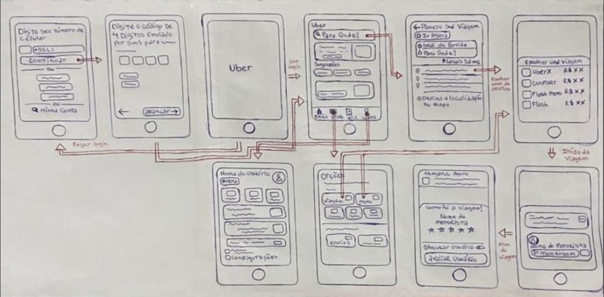

# Protótipo de Baixa Fidelidade – Uber 

Figura 1: Protótipo de Baixa-Fidelidade (Fonte: Ester Chaves)

## 1. Introdução 

Este documento tem como objetivo apresentar um protótipo de baixa fidelidade do aplicativo Uber. Trata-se de um modelo simples que destaca as principais funções do sistema. A ideia aqui é mostrar o fluxo básico das telas e das ações, sem se preocupar, por enquanto, com detalhes de design. Essa abordagem mais leve torna mais fácil entender como o usuário vai navegar pelo app e ajuda a verificar se a lógica de navegação faz sentido antes de partir para um desenvolvimento mais completo e detalhado. 

## 2. Objetivo 

O principal objetivo deste protótipo é mostrar como seria a experiência do usuário ao usar o aplicativo, desde o momento em que faz login até o final da corrida. Assim, conseguimos perceber se o fluxo das telas está claro e se as informações aparecem de forma prática e fácil de entender. Essa etapa é fundamental para identificar possíveis dúvidas e melhorar a navegação antes de criar o design final. 

## 3. Funcionalidades representadas no protótipo 

O protótipo de baixa fidelidade mostra as telas principais e as funções básicas do app, para que o fluxo de uso fique bem compreensível. Entre elas estão: 

* Tela de login: acesso à conta ou criação de novo cadastro. 

* Tela inicial: onde o usuário pode escolher o destino, as "opções" do aplicativo ou ferificar informações da conta. 

* Tela de opções: mostra todas as opções de uber, como o flash(entregas), o flash moto, opção de seniors(idosos), teens(menores de idade) e a de fazer reserva(agendar corrida).

* Tela de visualização das informações do usuário:onde o usuário mode modificar seus dados(nome, forma de pagamento, configurações do aplicativo, nota do aplicativo).

* Escolha do local de destino/partida: onde o usuário insere o destino no campo “Para onde?”.

* Escolha da viagem: seleção do tipo de corrida (UberX, Comfort, Moto, etc.) e visualização do valor estimado. 

* Confirmação da corrida: apresenta informações do motorista, modelo do carro e tempo de chegada.  

* Tela de avaliação: permite avaliar a corrida e deixar um comentário no final. 

Essas telas foram desenhadas de forma simples, apenas com traços, caixas e rascunhos, focando na estrutura e não no visual. 

## 4. Justificativa 

Esse tipo de protótipo ajuda a entender melhor como as telas vão funcionar e a identificar possíveis melhorias na navegação. Também torna mais simples compartilhar as ideias com outras pessoas, que podem dar sugestões e sugerir ajustes antes de partir para a versão final. 

## 5. Conclusão 

O protótipo de baixa fidelidade do Uber mostra de forma clara e direta as principais etapas que o usuário passa dentro do aplicativo. Apesar de ser uma versão mais simples, ele a entender bem como o sistema funciona e como as pessoas interagem com as telas. Com esse protótipo, dá para melhorar o projeto, aprimorar o design e criar versões mais completas, oferecendo uma experiência ainda melhor para os futuros usuários. 

## Histórico de revisão

| Versão | Data | Descrição | Autor(es) | Revisor(es) | Data da Revisão |
| -- | -- | -- | -- | -- | -- |
| 1.0 | 12/10/2025 | Criação do protótipo de baixa fidelidade e documentação.| Ester Chaves  |   | 15/10/2025 |
