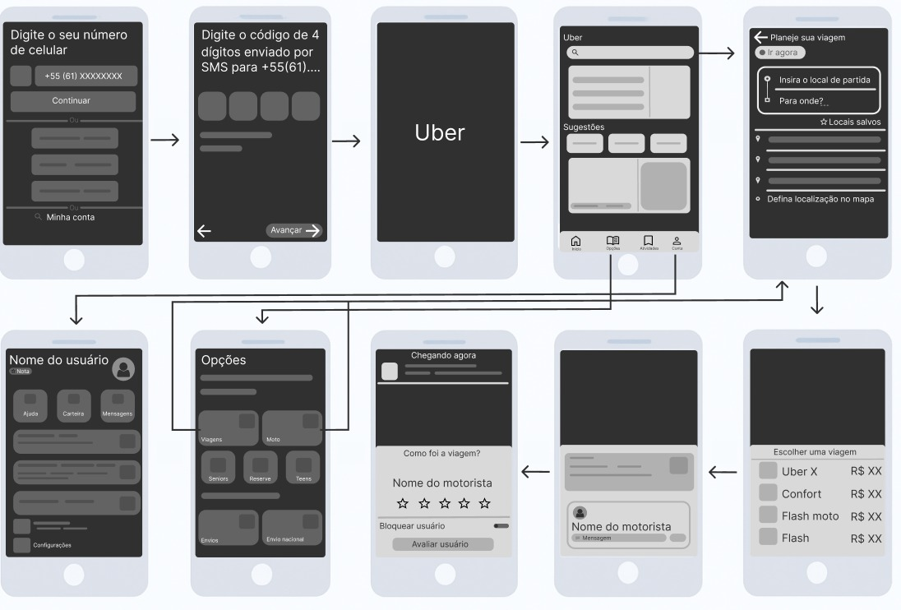

# Protótipo de Média Fidelidade – Uber 

[Acesse o site do Figma](https://www.figma.com/design/1Hhvu2YEUmaGupRJJNte30/Prot%C3%B3tipo-de-Baixa-Fidelidade--Curso-UX-Design---Google---Community-?node-id=0-1&t=OsCcT8erEILtzJrP-1)

## 1. Introdução 

Este documento apresenta o protótipo de média fidelidade do aplicativo Uber. Diferente do modelo de baixa fidelidade, neste existe uma maior preocupação com o visual e a estrutura das telas, utilizando cores, ícones e componentes mais próximos do design real. 

 O objetivo é representar o funcionamento do aplicativo de forma mais detalhada, simulando a experiência do usuário com mais fidelidade, mas ainda sem ser a versão final. Assim, é possível visualizar melhor o fluxo, testar a navegação e compreender como o design contribui para a desenpenho do app. 

## 2. Objetivo 

O principal objetivo deste protótipo consiste em aproximar o design com a versão final, mostrando como o usuário interage com os componentes da tela, como botões, ícones, textos e menus.  

Ele é utilizado para avaliar a precisão, consistência e fluidez da navegação, desde o login até o término da corrida, possibilitando a identificação de ajustes de layout e aprimoramentos na experiência antes da implementação final. 

## 3. Funcionalidades representadas no protótipo 

O protótipo de média fidelidade apresenta todas as telas essenciais do fluxo de uso do aplicativo, já com elementos visuais e interativos aprimorados. As principais funcionalidades são: 

* **Tela de login:** Inserção do número de celular e código de verificação por SMS para acessar a conta do usuário.

* **Tela inicial:** Campo “Para onde?” para inserir o destino, com sugestões e locais salvos.  

* **Planejamento da viajem:** Definição do ponto de partida e destino no mapa.

* **Escolha do tipo de viagem:** Seleção entre UberX, Comfort, Flash ou Moto, com exibição dos preços estimados. 

* **Acompanhamento da corrida:** Mostra informações do motorista, tipo de veículo e tempo de chegada.   

* **Tela de perfil do usuário:** Exibe opções como ajuda, carteira, mensagens e configurações. 

* **Tela deavaliação:** Permite avaliar o motorista, atribuir estrelas e deixar comentários sobre a corrida. 

Essas telas foram desenhadas com formas mais definidas, fontes consistentes e estrutura visual mais próxima do app real, mantendo a clareza e simplicidade do fluxo apresentado na versão anterior. 

## 4. Justificativa 

O protótipo de média fidelidade é uma etapa intermediária entre o esboço inicial e o design final. Ele possibilita a avaliação do visual e do desempenho antes da etapa de codificação, tornando o processo mais eficaz.  

Essa versão auxilia na validação do design visual, na organização das informações e na disposição dos elementos, além de promover uma comunicação mais eficaz entre designers, desenvolvedores e usuários durante o processo de aprimoramento do produto.  

## 5. Conclusão 

O protótipo de média fidelidade do aplicativo Uber representa um avanço significativo na visualização do produto final. Ele ilustra a interação do usuário com o aplicativo, enfatizando a estética, a estrutura das informações e a experiência do usuário. 

Esta etapa é crucial para avaliar o design, alinhar expectativas e fazer as correções necessárias antes do desenvolvimento completo, assegurando que a versão final do aplicativo seja funcional, intuitiva e agradável para o usuário. 

## Histórico de revisão

| Versão | Data | Descrição | Autor(es) | Revisor(es) | Data da Revisão |
| -- | -- | -- | -- | -- | -- |
| 1.0 | 17/10/2025 | Criação do protótipo de media fidelidade e documentação.| Ester Chaves  |   |  |

