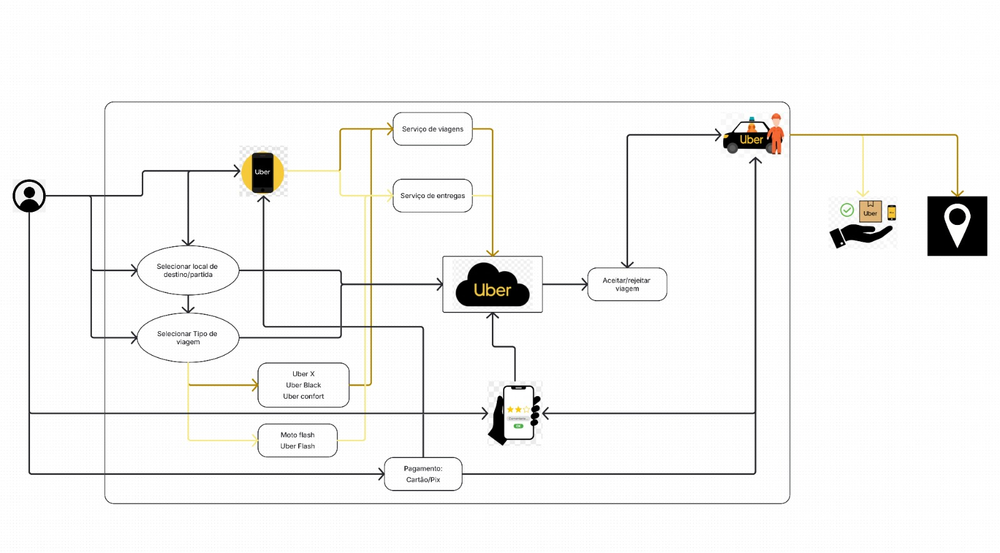
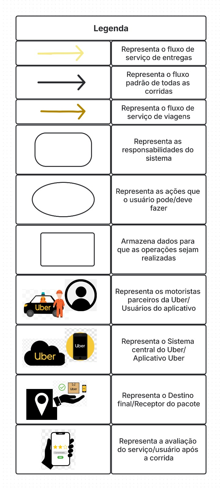

# Rich Picture

## 1. Introdução 

A Rich Picture é um recurso visual utilizado para demostrar de maneira clara e intuitiva os componentes, interações e processos de um sistema. Seu propósito é simplificar a compreensão de situações complexas, apresentando os participantes envolvidos, suas relações, fluxos de informação e possíveis problemas ou oportunidades.  

No caso deste trabalho, a Rich Picture foi desenvolvida para demonstrar o funcionamento do aplicativo Uber, destacando a interação entre o usuário, motorista (ou entregador) e a plataforma digital. O diagrama apresenta de maneira unificada o processo que envolve a solicitação de uma corrida ou entrega, a aceitação do serviço, o acompanhamento em tempo real, o pagamento e a avaliação final. 

## 2. Objetivo 

O objetivo desta Rich Picture é compreender e representar visualmente o fluxo operacional do sistema Uber, desde o instante em que o usuário realiza o pedido até a conclusão do serviço. Além disso, procura demonstrar como a tecnologia atua como intermediária entre o usuário e o fornecedor de serviço, destacando as diversas categorias de corridas, modalidades de entrega e métodos de pagamento. 

## 3. Funcionalidades 

* **Solicitação do serviço:** O usuário abre o aplicativo, define o ponto de partida e o destino e seleciona o tipo de serviço desejado (UberX, Uber Black, Uber Comfort, Uber Flash ou Moto Flash). 

* **Processamento do pedido:** A plataforma da Uber identifica o motorista ou entregador mais próximo e envia a solicitação. 

* **Aceitação da corrida:** O motorista/entregador pode aceitar ou recusar o serviço conforme sua disponibilidade. 

* **Execução do serviço:** Após a aceitação, o deslocamento ou entrega é realizado conforme o trajeto definido no aplicativo. 

* **Pagamento e avaliação:** O pagamento é feito digitalmente (cartão ou Pix), e o usuário avalia a experiência, fornecendo feedback para a plataforma. 

Figura 1: Rich Picture (Fonte: Ester Chaves)

Figura 2: Legenda de componentes do Rich Picture (Fonte: Ester Chaves)

## Histórico de revisão

| Versão | Data | Descrição | Autor(es) | Revisor(es) | Data da Revisão |
| -- | -- | -- | -- | -- | -- |
| 1.0 | 09/10/2025 | Criação do Rich Picture e documentação.| Erick Okamura  |   | 15/10/2025 |
