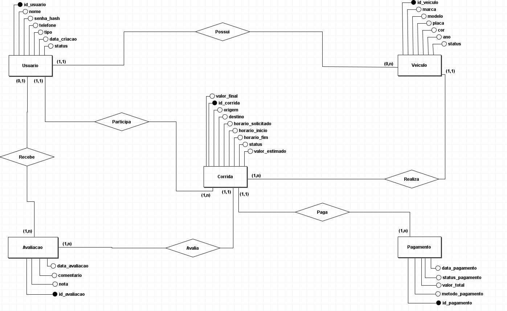
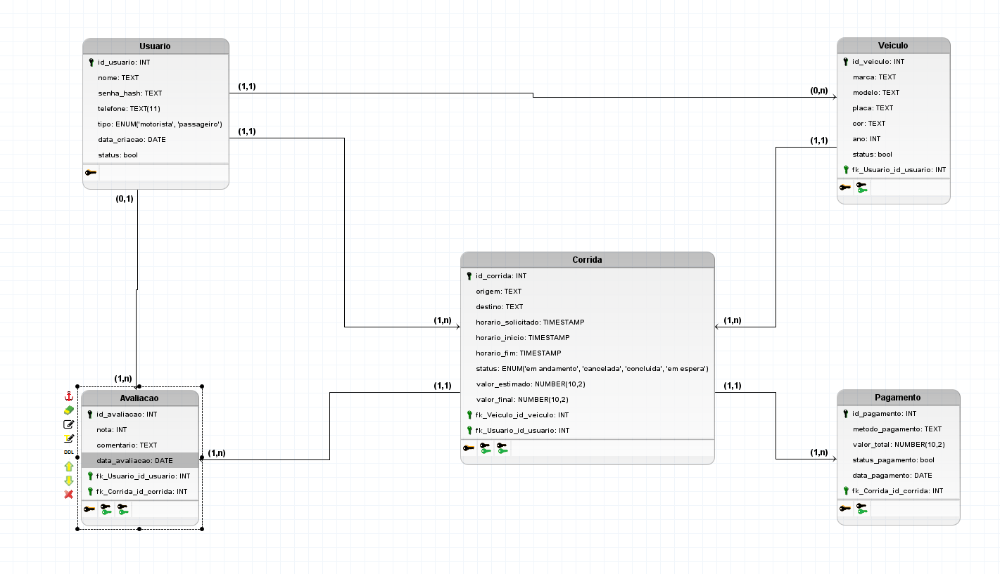

# DER/MER

O Diagrama Entidade-Relacionamento (DER) e o Modelo Entidade-Relacionamento (MER) são etapas fundamentais para realizar o primeiro contato entre a concepção do projeto e a implementação do banco de dados. Esses modelos permitem representar de forma estruturada as entidades principais do sistema e as interações entre elas.

Seguindo a proposta da Uber, o sistema foi idealizado para conectar motoristas e passageiros em corridas intermediadas por uma plataforma digital. Nesse contexto, o Usuário representa tanto o passageiro quanto o motorista, sendo o ponto central de interação do aplicativo. O Veículo está associado ao motorista e contém as informações do automóvel utilizado nas viagens. Quando uma solicitação de transporte é realizada, uma Corrida é criada, reunindo os dados do passageiro, do motorista, do trajeto e do valor da viagem. Ao final da corrida, o Pagamento é processado conforme o método escolhido pelo passageiro, registrando as informações financeiras relacionadas à transação. Por fim, a Avaliação permite que tanto o passageiro quanto o motorista atribuam notas e comentários após a corrida, contribuindo para a reputação e qualidade do serviço dentro da plataforma.

Dessa forma, as entidades e seus relacionamentos refletem o fluxo essencial do funcionamento do aplicativo, desde a solicitação de uma corrida até sua finalização e avaliação, fornecendo a base estrutural para o desenvolvimento do banco de dados e das futuras funcionalidades do sistema.

## Metodologia

Para o desenvolvimento desse tópico, foi utilizada o BrModelo ([Download](https://www.sis4.com/)), ferramenta que possui muitas funcionalidades para a concepção da modelagem de dados, utilizado para a confecção do DER e do DLD. A plataforma também possui uma versão web, chamada [BrModeloWeb](https://www.brmodeloweb.com/lang/pt-br/index.html). Ambas as plataformas são gratuitas.

## Modelo Entidade-Relacionamento (MER)

Dantas et. al(2016) define o Modelo Entidade-Relacionamento como a descrição de coisas do mundo real, através de objetos chamados entidades e seus relacionamentos, ou seja, a forma como essas entidades se relacionam. No contexto da modelagem de dados, podemos tirar do texto acima, suas entidades, seus atributos e os relacionamentos, para a formação de uma base de dados coerente.

Assim, o MER desenvolvido para esse projeto leva em consideração 5 entidades principais:

- Usuário
- Avaliação
- Veículo
- Corrida
- Pagamento

Como para este projeto, não foram utilizadas relações de cardinalidade muitos-para-muitos (n:n), as relações serão detalhadas após o MER.

### Usuário

**Usuario** (<u>id_usuario</u>, nome, email, senha, telefone, tipo (ENUM: 'motorista', 'passageiro'), nota_media)

---

### Veículo
**Veiculo** (<u>id_veiculo</u>, id_motorista_FK, modelo, marca, placa, ano, cor)

---

### Corrida
**Corrida** (<u>id_corrida</u>, id_motorista_FK, id_passageiro_FK, origem, destino, distancia, valor, status(ENUM'solicitada''em_andamento', 'concluída', 'cancelada'), data_hora_inicio, data_hora_fim)

---

### Pagamento
**Pagamento** (<u>id_pagamento</u>, id_corrida_FK, valor_total, metodo (ENUM: 'cartão', 'dinheiro', 'pix'), status_pagamento (ENUM: 'pendente', 'pago', 'falhou'), data_pagamento)

---

### Avaliação
**Avaliacao** (<u>id_avaliacao</u>, id_corrida_FK, id_avaliador_FK, id_avaliado_FK, nota, comentario, data_avaliacao)

---

### Observação

- Atributos sublinhados representam as chaves primárias;
- Chaves estrangeiras possuem a nomeclatura "FK", seus atributos originalmente não possuem essa nomeclatura, mas didaticamente é adequado acrescentar.

###  Resumo das Relações Principais

| Entidade Principal | Relações |
|--------------------|-----------|
| **Usuário** | Possui veículo, solicita corrida, realiza corrida, avalia e é avaliado |
| **Veículo** | Pertence a um motorista |
| **Corrida** | Associada a um motorista, um passageiro e um pagamento |
| **Pagamento** | Refere-se a uma corrida |
| **Avaliação** | Relaciona avaliador e avaliado dentro de uma corrida |

---

## Diagrama Entidade-Relacionamento (DER) 

Segundo Franck et. al (2021), o DER é uma espécie de fluxograma que faz a relação entre objetos/entidades dentro de um sistema. Ele é a representação visual mais clara do MER, apresentado anteriormente. O DER segue um conjunto de regras para representação de entidades e relações, que são respeitadas na representação do grupo.

Agora, com o MER definindo os atributos e como as entidades se relacionam, originou-se o diagrama que melhor representa a ideia concebida pelo grupo:

Figura 1: Diagrama Entidade-Relacionamento(DER) (Fonte: Caio Sabino).

Importante ressaltar que na diagramação, as chaves estrangeiras (FK) não são presentes como atributos originários da entidade, o que segue as regras de convenção para desenvolvimeto do DER.

## Extra - Diagrama Lógico de Dados (DLD)

O diagrama lógico de dados é uma representação mais próxima da implementação do banco de dados real, com uma identificação mais clara de como estão organizados os atributos, chaves primárias, chaves estrangeiras e tipos de dados de cada atributo. Essa representação, em algumas ferramentas, pode gerar o código SQL a partir do DLD.

Figura 2: Diagrama Lógico de Dados (Fonte: Caio Sabino).

## Referências Bibliográficas

> FRANCK, K. M.; PEREIRA, R. F.; DANTAS FILHO, J. V. Diagrama Entidade-Relacionamento: uma ferramenta para modelagem de dados conceituais em Engenharia de Software. Research, Society and Development, v. 10, n. 8, p. e49510817776, 15 jul. 2021.

> DANTAS, C. M.; FLAVIO RIBEIRO CÓRDULA; WAGNER. ANÁLISE DA REPRESENTAÇÃO DA INFORMAÇÃO EM MODELOS ENTIDADE RELACIONAMENTO COM BASE EM METADADOS. Archeion Online, v. 4, n. 1, p. 40–63, 31 dez. 2016.

## Histórico de revisão

| Versão | Data | Descrição | Autor(es) | Revisor(es) | Data da Revisão |
| -- | -- | -- | -- | -- | -- |
| 1.0 | 16/10/2025 | Criação do DER/MER/DLD e documentação. | Caio Sabino  |   | 16/10/2025 |

‌

‌